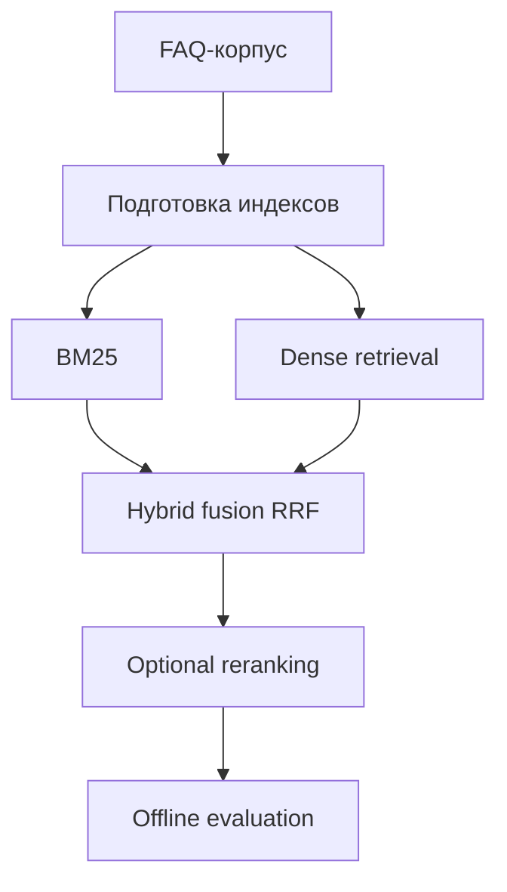

# Hybrid FAQ Retrieval Benchmark

## Кратко
Стенд для сравнения подходов к FAQ-поиску: BM25, dense retrieval, hybrid fusion и optional reranking по единому протоколу offline evaluation.

## Задача
Сравнить retrieval-подходы на FAQ-задаче в одинаковых условиях и понять, когда hybrid fusion действительно лучше чисто sparse или чисто dense режима.

## Что улучшено
- `Hybrid (RRF)` даёт лучший баланс точности и устойчивости;
- reranking улучшает порядок документов в top-k;
- нормализация запроса уменьшает чувствительность к шумному пользовательскому вводу.

## Архитектура


## Метрики и результаты
Если `reports/` уже содержит результаты, подставить реальные числа.

| Режим | Recall@K | MRR@K | nDCG@K | HitRate@K | latency p50/p95 |
|---|---:|---:|---:|---:|---:|
| BM25 | TBD | TBD | TBD | TBD | TBD |
| Dense retrieval | TBD | TBD | TBD | TBD | TBD |
| Hybrid (RRF) | TBD | TBD | TBD | TBD | TBD |
| Hybrid (RRF) + reranking | TBD | TBD | TBD | TBD | TBD |

## Структура репозитория
- `configs/` — конфигурации экспериментов;
- `data/demo_faq/` — демонстрационный FAQ-корпус;
- `faq_bench/`, `src/faq_bench/` — логика benchmark;
- `reports/` — результаты оценки;
- `scripts/` — сценарии запуска;
- `tests/` — проверки.

## Запуск
```bash
python -m venv .venv
source .venv/bin/activate
pip install -r requirements.txt
python scripts/run_benchmark.py
```

## Ограничения
- benchmark отражает offline-режим и не заменяет онлайн-проверку;
- dense retrieval чувствителен к качеству эмбеддингов;
- RRF и reranking требуют настройки под конкретный FAQ-корпус.

## Направления развития
- добавить разрез по типам запросов;
- показать ошибки на шумных и коротких запросах;
- вынести результаты в отдельный отчёт с графиками;
- добавить API-слой для быстрого воспроизведения лучших режимов.
